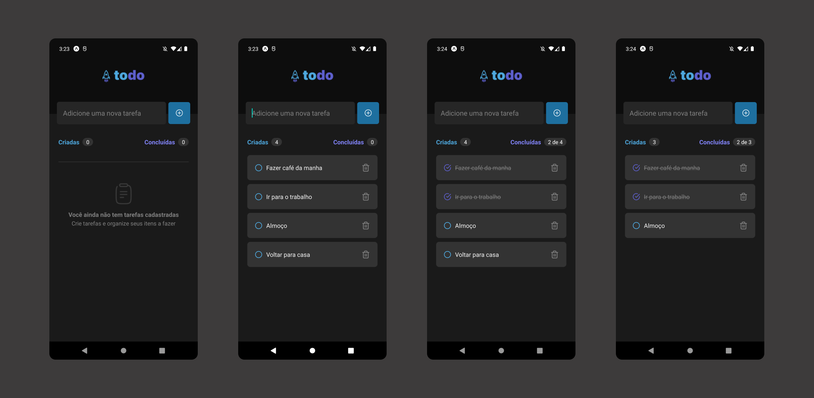

<h1 align="center"> todo-list-app </h1>

  <a href="#-tecnologias">Tecnologias</a>&nbsp;&nbsp;&nbsp;|&nbsp;&nbsp;&nbsp;
  <a href="#-projeto">Projeto</a>&nbsp;&nbsp;&nbsp;|&nbsp;&nbsp;&nbsp;
  <a href="#memo-licença">Licença</a>

  

 

  

## 🚀 Tecnologias

Esse projeto foi desenvolvido com as seguintes tecnologias:

- React Native
- Expo
- TypeScript

## 🔥 Algumas features neste projeto

- React Hooks
- Tipagem com TypeScript
- Componentização com React Native

## ✨ Neste projeto você pode ver

- Criação de tarefas no estilo todo-list.
- Listagem de tarefas criadas com opção de marcar como finalizada ou excluir.
- Resumo de tarefas criadas.
- Resumo de taregas finalizadas baseadas no número de tarefas criadas.

## 💻 Projeto

- Esta é uma aplicação simples de criação de tarefas no estilo todo-list, criada com React Native e Expo.

## ✅ Esse projeto foi criado ao longo dos desafios do curso Ignite React Native da plataforma Rocketseat

## 📝 Licença

Esse projeto está sob a licença MIT.

---
